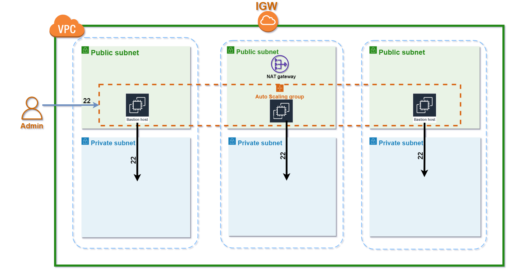

# AWS Bastion host Terraform module

## This module will create:
- _SSH Bastion host_

## **Diagram**


## **Usage**
``terraform
module "bastion" {
  source = "./bastion" # <== Path to bastion module.

  bastion_name          = var.bastion_name
  bucket_name           = "s3-for-public-key"
  region                = "us-east-1"
  vpc_id                = module.networking.vpc_id
  is_lb_private         = true
  bastion_host_key_pair = aws_key_pair.test.key_name


  elb_subnets         = module.networking.public_subnets
  autoscaling_subnets = module.networking.public_subnets

  tags = {
    name        = "my_bastion_name"
    description = "my_bastion_description"
  }
}

```bash
export AWS_ACCESS_KEY_ID=<write your access key id>
export AWS_SECRET_ACCESS_KEY=<write you secret access key>
export AWS_DEFAULT_REGION=<write default region to create resource in>
```

Then perform the following commands on the root folder:
- `terraform init` terraform initialization
- `terraform plan` to see the infrastructure plan
- `terraform apply` to apply infrastructure build
- `terraform destroy` to destroy the infrastructure

## **Resources**
|Name|Type|
|----|----|
|